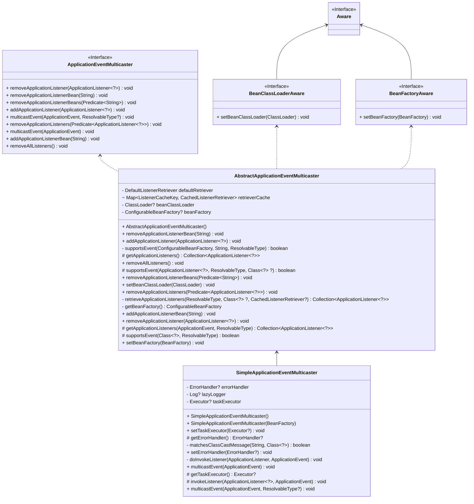

# SimpleApplicationEventMulticaster

基于 springboot3.2 和 springframework6.1.4

## 简介

### 观察者设计模式

Spring 框架中的事件机制是观察者设计模式的一个典型实现，它基于发布-订阅模式（Publish-Subscribe）。在 Spring
中，事件是由事件发布者（ApplicationEventPublisher）发布的，而事件监听器（ApplicationListener）则是观察者，负责处理特定类型的事件。

以下是 Spring 框架中事件机制的主要组成部分：

1. **事件（Event）：**
    - 事件是应用程序中可能发生的事情，它通常是一个继承自 `ApplicationEvent` 的类。
    - 开发人员可以定义自己的事件类，以便在应用程序中传递关键信息。

2. **事件发布者（ApplicationEventPublisher）：**
    - `ApplicationEventPublisher` 接口是事件发布者的标准接口，它定义了发布事件的方法 `publishEvent(Event event)`。
    - Spring 中的容器，如 `ApplicationContext`，实现了这个接口，允许在应用程序中发布事件。

3. **事件监听器（ApplicationListener）：**
    - `ApplicationListener` 接口是事件监听器的标准接口，它定义了用于处理事件的方法 `onApplicationEvent(Event event)`。
    - 开发人员可以实现这个接口，以便在事件发生时执行自定义的逻辑。

4. **事件广播器（ApplicationEventMulticaster）：**
    - 事件广播器是框架内部的组件，负责将事件分发给所有注册的监听器。
    - Spring 提供了多个事件广播器的实现，其中 `SimpleApplicationEventMulticaster` 是一个简单的单线程实现。

下面是一个简单的 Spring 事件机制的示例：

```java
// 1. 定义事件
public class MyCustomEvent extends ApplicationEvent {
    public MyCustomEvent(Object source) {
        super(source);
    }

    // 可以添加自定义的方法和属性
}

// 2. 定义事件监听器
public class MyCustomEventListener implements ApplicationListener<MyCustomEvent> {
    @Override
    public void onApplicationEvent(MyCustomEvent event) {
        // 处理事件的逻辑
        System.out.println("Received Custom Event: " + event.toString());
    }
}

// 3. 在应用程序中发布事件
public class EventPublisher {
    @Autowired
    private ApplicationEventPublisher eventPublisher;

    public void publishCustomEvent() {
        MyCustomEvent event = new MyCustomEvent(this);
        eventPublisher.publishEvent(event);
    }
}
```

在上述示例中，`MyCustomEvent` 是一个自定义的事件类，`MyCustomEventListener`
是一个事件监听器。通过 `ApplicationEventPublisher` 接口，`EventPublisher` 类可以在应用程序中发布 `MyCustomEvent`
事件。当事件被发布时，所有注册的监听器（比如 `MyCustomEventListener`）都会收到通知并执行相应的处理逻辑。

这个例子展示了 Spring 框架中事件机制如何实现观察者设计模式，通过事件的发布者和监听器之间的松耦合关系，实现了一对多的通知机制。

#### ApplicationEventPublisher 和 ApplicationEventMulticaster

`ApplicationEventPublisher` 和 `ApplicationEventMulticaster` 是 Spring 框架中两个不同的接口，但它们在事件处理中有一定的关系。

1. **ApplicationEventPublisher:**
    - `ApplicationEventPublisher` 是一个接口，定义了事件发布者的行为。它负责将事件通知给注册的监听器。
    - 其主要方法是 `publishEvent(ApplicationEvent event)`，用于发布一个应用事件，将事件传递给所有注册的监听器。

   ```java
   public interface ApplicationEventPublisher {
       void publishEvent(ApplicationEvent event);
       // ...
   }
   ```

2. **ApplicationEventMulticaster:**
    - `ApplicationEventMulticaster` 也是一个接口，定义了事件广播器的行为。它负责将事件广播给所有注册的监听器。
    - `ApplicationEventMulticaster` 的实现决定了事件是同步还是异步传播，以及其他一些广播策略。

   ```java
   public interface ApplicationEventMulticaster {
       void addApplicationListener(ApplicationListener<?> listener);
       void removeApplicationListener(ApplicationListener<?> listener);
       void multicastEvent(ApplicationEvent event);
       // ...
   }
   ```

在 Spring 中，`ApplicationEventPublisher` 接口通常由 Spring 容器（如 `ApplicationContext`
）实现，而 `ApplicationEventMulticaster` 接口通常由一个具体的实现类（如 `SimpleApplicationEventMulticaster`）来处理事件的多播。

当你使用 `ApplicationEventPublisher` 发布事件时，底层通常会使用 `ApplicationEventMulticaster` 来实际进行事件的广播。Spring
提供了多个实现了 `ApplicationEventMulticaster`
接口的类，可以根据应用程序的需求选择合适的实现。`SimpleApplicationEventMulticaster`
是其中一个简单的实现，而 `AsyncEventMulticaster` 则支持异步事件传播。

### SimpleApplicationEventMulticaster

`SimpleApplicationEventMulticaster` 是 Spring Framework 中用于处理事件（Event）的一个简单的事件广播器（Event
Multicaster）实现之一。在 Spring
中，事件驱动编程是通过使用观察者设计模式来实现的，其中事件是由发布者（Publisher）产生并由订阅者（Subscriber）处理。事件广播器负责将事件传递给所有注册的监听器，以便它们可以相应地处理这些事件。

以下是对 `SimpleApplicationEventMulticaster` 的主要介绍：

1. **实现方式：** `SimpleApplicationEventMulticaster` 实现了 `ApplicationEventMulticaster` 接口，该接口定义了事件广播器的基本行为。

2. **单线程模型：** `SimpleApplicationEventMulticaster`
   是一个单线程的事件广播器，它按照注册的监听器的顺序同步地触发事件。这意味着事件广播是在同一个线程中进行的，一个监听器的处理过程会完全执行完毕后才会继续下一个监听器。

3. **同步处理：** 事件的广播是同步的，即发布者发布事件时，会阻塞直到所有注册的监听器都处理完该事件。

4. **注册监听器：** 通过 `addApplicationListener` 方法可以向 `SimpleApplicationEventMulticaster`
   注册监听器，这些监听器必须实现 `ApplicationListener` 接口。

5. **触发事件：** 使用 `multicastEvent` 方法触发事件，它将事件传递给所有注册的监听器。

使用示例：

```java
// 创建事件
MyCustomEvent event = new MyCustomEvent(source);

// 创建 SimpleApplicationEventMulticaster
SimpleApplicationEventMulticaster eventMulticaster = new SimpleApplicationEventMulticaster();

// 注册监听器
eventMulticaster.

addApplicationListener(new MyCustomEventListener());

// 触发事件
        eventMulticaster.

multicastEvent(event);
```

需要注意的是，`SimpleApplicationEventMulticaster` 是一个简单的事件广播器实现，适用于小型应用或不需要复杂事件处理机制的情况。对于大型应用或需要更高级特性的情况，Spring
提供了其他更复杂的事件广播器实现，如 `AsyncEventMulticaster` 等。

`ApplicationListener`是Spring框架中的一个接口，用于监听应用程序的生命周期事件。它定义了一组回调方法，可以在应用程序启动、停止或重新加载时执行相应的逻辑。

### ApplicationListener

`ApplicationListener`
接口有一个泛型参数，用于指定要监听的事件类型。当应用程序发布与指定事件类型相匹配的事件时，实现了`ApplicationListener`
接口的类将被通知并执行相应的回调方法。

以下是`ApplicationListener`接口的常用回调方法：

`onApplicationEvent(ApplicationEvent event)`：该方法在监听到指定事件类型被调用，参数event是触发的事件对象。
`supportsEventType(Class<? extends ApplicationEvent> eventType)`：该方法用于判断是否持监听指定事件类型。
`supportsSourceType(Class<?> sourceType)`：该方法用于判断是否支持监听指定事件源类型。
通过实现`ApplicationListener`接口，可以在应用程序的不同生命周期阶段执行自定义的逻辑，在应用程序启动时进行初始化操作，或在应用程序停止时进行资源释放。

## SimpleApplicationEventMulticaster 类图



## listener 的缓存

defaultRetriever 包括了所有 listener。retrieverCache 是 applicationEvent -> applicationListeners 的 cache。

```java
    private final DefaultListenerRetriever defaultRetriever = new DefaultListenerRetriever();

final Map<ListenerCacheKey, CachedListenerRetriever> retrieverCache = new ConcurrentHashMap<>(64);
```

```java
    private class DefaultListenerRetriever {

    public final Set<ApplicationListener<?>> applicationListeners = new LinkedHashSet<>();

    public final Set<String> applicationListenerBeans = new LinkedHashSet<>();

    public Collection<ApplicationListener<?>> getApplicationListeners() {
        List<ApplicationListener<?>> allListeners = new ArrayList<>(
                this.applicationListeners.size() + this.applicationListenerBeans.size());
        allListeners.addAll(this.applicationListeners);
        if (!this.applicationListenerBeans.isEmpty()) {
            BeanFactory beanFactory = getBeanFactory();
            for (String listenerBeanName : this.applicationListenerBeans) {
                try {
                    ApplicationListener<?> listener =
                            beanFactory.getBean(listenerBeanName, ApplicationListener.class);
                    if (!allListeners.contains(listener)) {
                        allListeners.add(listener);
                    }
                } catch (NoSuchBeanDefinitionException ex) {
                    // Singleton listener instance (without backing bean definition) disappeared -
                    // probably in the middle of the destruction phase
                }
            }
        }
        AnnotationAwareOrderComparator.sort(allListeners);
        return allListeners;
    }
}
```

## 检测是否 listener 是否支持 event

```java
    protected boolean supportsEvent(
        ApplicationListener<?> listener, ResolvableType eventType, @Nullable Class<?> sourceType) {

    GenericApplicationListener smartListener = (listener instanceof GenericApplicationListener gal ? gal :
            new GenericApplicationListenerAdapter(listener));
    return (smartListener.supportsEventType(eventType) && smartListener.supportsSourceType(sourceType));
}
```

## 初始化 publisher 和注册 listener

在 `AbstractApplicationContext` 里面 `refresh()`方法：

**initApplicationEventMulticaster**

```java
    protected void initApplicationEventMulticaster() {
    ConfigurableListableBeanFactory beanFactory = getBeanFactory();
    if (beanFactory.containsLocalBean(APPLICATION_EVENT_MULTICASTER_BEAN_NAME)) {
        this.applicationEventMulticaster =
                beanFactory.getBean(APPLICATION_EVENT_MULTICASTER_BEAN_NAME, ApplicationEventMulticaster.class);
        if (logger.isTraceEnabled()) {
            logger.trace("Using ApplicationEventMulticaster [" + this.applicationEventMulticaster + "]");
        }
    } else {
        this.applicationEventMulticaster = new SimpleApplicationEventMulticaster(beanFactory);
        beanFactory.registerSingleton(APPLICATION_EVENT_MULTICASTER_BEAN_NAME, this.applicationEventMulticaster);
        if (logger.isTraceEnabled()) {
            logger.trace("No '" + APPLICATION_EVENT_MULTICASTER_BEAN_NAME + "' bean, using " +
                    "[" + this.applicationEventMulticaster.getClass().getSimpleName() + "]");
        }
    }
}
```

**registerListeners**：此方法还在 publisher 里面添加了在 call refresh（）前注册的 applicationListener 和发布在 call
refresh（）前添加的 applicationEvent。

```java
    protected void registerListeners() {
    // Register statically specified listeners first.
    for (ApplicationListener<?> listener : getApplicationListeners()) {
        getApplicationEventMulticaster().addApplicationListener(listener);
    }

    // Do not initialize FactoryBeans here: We need to leave all regular beans
    // uninitialized to let post-processors apply to them!
    String[] listenerBeanNames = getBeanNamesForType(ApplicationListener.class, true, false);
    for (String listenerBeanName : listenerBeanNames) {
        getApplicationEventMulticaster().addApplicationListenerBean(listenerBeanName);
    }

    // Publish early application events now that we finally have a multicaster...
    Set<ApplicationEvent> earlyEventsToProcess = this.earlyApplicationEvents;
    this.earlyApplicationEvents = null;
    if (!CollectionUtils.isEmpty(earlyEventsToProcess)) {
        for (ApplicationEvent earlyEvent : earlyEventsToProcess) {
            getApplicationEventMulticaster().multicastEvent(earlyEvent);
        }
    }
}
```

## 发布事件

先从 retrieverCache 缓存里面获取，若为 null 再 call retrieveApplicationListeners() 获取

```java
    protected Collection<ApplicationListener<?>> getApplicationListeners(
        ApplicationEvent event, ResolvableType eventType) {

    Object source = event.getSource();
    Class<?> sourceType = (source != null ? source.getClass() : null);
    ListenerCacheKey cacheKey = new ListenerCacheKey(eventType, sourceType);

    // Potential new retriever to populate
    CachedListenerRetriever newRetriever = null;

    // Quick check for existing entry on ConcurrentHashMap
    CachedListenerRetriever existingRetriever = this.retrieverCache.get(cacheKey);
    if (existingRetriever == null) {
        // Caching a new ListenerRetriever if possible
        if (this.beanClassLoader == null ||
                (ClassUtils.isCacheSafe(event.getClass(), this.beanClassLoader) &&
                        (sourceType == null || ClassUtils.isCacheSafe(sourceType, this.beanClassLoader)))) {
            newRetriever = new CachedListenerRetriever();
            existingRetriever = this.retrieverCache.putIfAbsent(cacheKey, newRetriever);
            if (existingRetriever != null) {
                newRetriever = null;  // no need to populate it in retrieveApplicationListeners
            }
        }
    }

    if (existingRetriever != null) {
        Collection<ApplicationListener<?>> result = existingRetriever.getApplicationListeners();
        if (result != null) {
            return result;
        }
        // If result is null, the existing retriever is not fully populated yet by another thread.
        // Proceed like caching wasn't possible for this current local attempt.
    }

    return retrieveApplicationListeners(eventType, sourceType, newRetriever);
}
```

支持多线程处理，循环支持此 applicationEvent 的 applicationListeners。

```java
    public void multicastEvent(ApplicationEvent event, @Nullable ResolvableType eventType) {
    ResolvableType type = (eventType != null ? eventType : ResolvableType.forInstance(event));
    Executor executor = getTaskExecutor();
    for (ApplicationListener<?> listener : getApplicationListeners(event, type)) {
        if (executor != null && listener.supportsAsyncExecution()) {
            try {
                executor.execute(() -> invokeListener(listener, event));
            } catch (RejectedExecutionException ex) {
                // Probably on shutdown -> invoke listener locally instead
                invokeListener(listener, event);
            }
        } else {
            invokeListener(listener, event);
        }
    }
}
```

最后 call listener 的 onApplicationEvent 方法。

```java
    private void doInvokeListener(ApplicationListener listener, ApplicationEvent event) {
    try {
        listener.onApplicationEvent(event);
    } catch (ClassCastException ex) {
        String msg = ex.getMessage();
        if (msg == null || matchesClassCastMessage(msg, event.getClass()) ||
                (event instanceof PayloadApplicationEvent payloadEvent &&
                        matchesClassCastMessage(msg, payloadEvent.getPayload().getClass()))) {
            // Possibly a lambda-defined listener which we could not resolve the generic event type for
            // -> let's suppress the exception.
            Log loggerToUse = this.lazyLogger;
            if (loggerToUse == null) {
                loggerToUse = LogFactory.getLog(getClass());
                this.lazyLogger = loggerToUse;
            }
            if (loggerToUse.isTraceEnabled()) {
                loggerToUse.trace("Non-matching event type for listener: " + listener, ex);
            }
        } else {
            throw ex;
        }
    }
}
```
