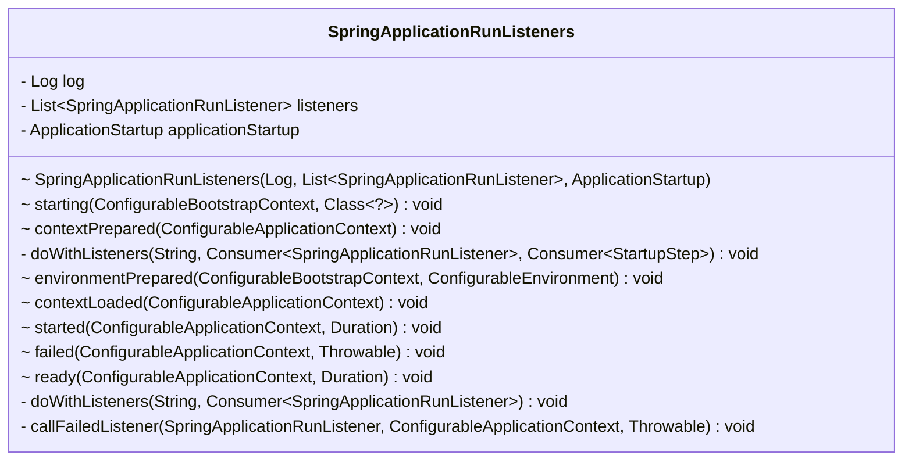

# SpringApplicationRunListeners

基于 springboot3.2 和 springframework6.1.4

## 简介

`SpringApplicationRunListeners` 是 Spring Boot 中的一个监听器接口，用于监听 Spring Boot 应用程序的运行过程。它定义了在不同阶段触发的监听器回调方法，允许开发者在应用程序启动的不同生命周期阶段执行自定义逻辑。

这个接口中包含了一系列方法，其中一些重要的方法包括：

1. **`starting` 方法：**
   ```java
   void starting(ConfigurableBootstrapContext bootstrapContext);
   ```
   在 Spring Boot 应用程序开始启动时触发。`ConfigurableBootstrapContext` 提供了引导上下文的配置，允许监听器在应用程序引导阶段执行一些自定义初始化。

2. **`environmentPrepared` 方法：**
   ```java
   void environmentPrepared(ConfigurableBootstrapContext bootstrapContext, ConfigurableEnvironment environment);
   ```
   在应用程序环境准备好后触发。此时，应用程序的环境已经配置完成，但上下文还没有创建。允许监听器在此阶段对环境进行进一步的自定义配置。

3. **`contextPrepared` 方法：**
   ```java
   void contextPrepared(ConfigurableApplicationContext context);
   ```
   在应用程序上下文准备好后触发。此时，应用程序上下文已经准备好，但尚未刷新。允许监听器在此阶段执行一些自定义的上下文准备逻辑。

4. **`contextLoaded` 方法：**
   ```java
   void contextLoaded(ConfigurableApplicationContext context);
   ```
   在应用程序上下文加载完成后触发。此时，应用程序上下文已经被刷新，但尚未启动。允许监听器在此阶段执行一些自定义的上下文加载逻辑。

5. **`started` 方法：**
   ```java
   void started(ConfigurableApplicationContext context);
   ```
   在应用程序已经启动并正在运行时触发。此时，应用程序上下文已经启动。允许监听器在应用程序完全启动后执行一些自定义逻辑。

6. **`running` 方法：**
   ```java
   void running(ConfigurableApplicationContext context);
   ```
   在应用程序正在运行时触发。此时，应用程序已经完全启动并正在运行。允许监听器在应用程序运行时执行一些自定义逻辑。

7. **`failed` 方法：**
   ```java
   void failed(ConfigurableApplicationContext context, Throwable exception);
   ```
   在应用程序启动失败时触发。允许监听器在应用程序启动失败时执行一些自定义逻辑。

这些方法提供了灵活的扩展点，使得开发者可以在应用程序的不同生命周期阶段插入自定义的逻辑。通过实现 `SpringApplicationRunListeners` 接口，开发者可以创建自定义的应用程序监听器，并通过 `SpringApplication`
的 `addListeners` 方法注册它们。这样，在应用程序的不同阶段，这些监听器将会收到回调并执行相应的操作。



## run源码

在 `SpringApplication` 类的 `run` 方法中，会触发 `SpringApplicationRunListeners` 的 `starting` 方法，`environmentPrepared` 方法，`contextPrepared` 方法，`contextLoaded` 方法，`started` 方法，`failed`
方法，`ready` 方法。

```java
public ConfigurableApplicationContext run(String... args) {
    Startup startup = Startup.create();
    if (this.registerShutdownHook) {
        SpringApplication.shutdownHook.enableShutdownHookAddition();
    }
    DefaultBootstrapContext bootstrapContext = createBootstrapContext();
    ConfigurableApplicationContext context = null;
    configureHeadlessProperty();
    SpringApplicationRunListeners listeners = getRunListeners(args); // 从 spring.factories 中获取接口 SpringApplicationRunListener.class 的实现类 org.springframework.boot.context.event.EventPublishingRunListener
    listeners.starting(bootstrapContext, this.mainApplicationClass); // 触发 starting 方法
    try {
        ApplicationArguments applicationArguments = new DefaultApplicationArguments(args);
        ConfigurableEnvironment environment = prepareEnvironment(listeners, bootstrapContext, applicationArguments); // 触发 environmentPrepared 方法
        Banner printedBanner = printBanner(environment);
        context = createApplicationContext();
        context.setApplicationStartup(this.applicationStartup);
        prepareContext(bootstrapContext, context, environment, listeners, applicationArguments, printedBanner); // 触发 contextPrepared、contextLoaded 方法
        refreshContext(context);
        afterRefresh(context, applicationArguments);
        startup.started();
        if (this.logStartupInfo) {
            new StartupInfoLogger(this.mainApplicationClass).logStarted(getApplicationLog(), startup);
        }
        listeners.started(context, startup.timeTakenToStarted()); // 触发 started 方法
        callRunners(context, applicationArguments);
    } catch (Throwable ex) {
        throw handleRunFailure(context, ex, listeners);
    }
    try {
        if (context.isRunning()) {
            listeners.ready(context, startup.ready()); // 触发 ready 方法
        }
    } catch (Throwable ex) {
        throw handleRunFailure(context, ex, null); // 触发 failed 方法
    }
    return context;
}
```

## EventPublishingRunListener

- `starting` 方法对应的是 ApplicationStartingEvent 事件;
- `environmentPrepared` 方法对应的是 ApplicationEnvironmentPreparedEvent 事件;
- `contextPrepared` 方法对应的是 ApplicationContextInitializedEvent 事件;
- `contextLoaded` 方法对应的是 ApplicationPreparedEvent 事件，
- `started` 方法对应的是 ApplicationStartedEvent 事件，
- `failed` 方法对应的是 ApplicationFailedEvent 事件，
- `ready` 方法对应的是 ApplicationReadyEvent 事件。

在此类中会从`SpringApplication`中获取`listeners`，然后添加到`initialMulticaster`中，然后调用`multicastEvent`方法。

```java
private void multicastInitialEvent(ApplicationEvent event) {
    refreshApplicationListeners();
    this.initialMulticaster.multicastEvent(event);
}

private void refreshApplicationListeners() {
    this.application.getListeners().forEach(this.initialMulticaster::addApplicationListener);
}
```

而`listeners`的初始化是在`SpringApplication`的构造方法里面完成的。

```java
setListeners((Collection) getSpringFactoriesInstances(ApplicationListener .class));
```

```properties
# Application Listeners
org.springframework.context.ApplicationListener=\
org.springframework.boot.ClearCachesApplicationListener,\
org.springframework.boot.builder.ParentContextCloserApplicationListener,\
org.springframework.boot.context.FileEncodingApplicationListener,\
org.springframework.boot.context.config.AnsiOutputApplicationListener,\
org.springframework.boot.context.config.DelegatingApplicationListener,\
org.springframework.boot.context.logging.LoggingApplicationListener,\
org.springframework.boot.env.EnvironmentPostProcessorApplicationListener
```

- `ClearCachesApplicationListener`监听的事件是`ContextRefreshedEvent`;
- `ParentContextCloserApplicationListener`监听的事件是`ParentContextAvailableEvent`;
- `FileEncodingApplicationListener`监听的事件是`ApplicationEnvironmentPreparedEvent`;
- `AnsiOutputApplicationListener`监听的事件是`ApplicationEnvironmentPreparedEvent`;
- `DelegatingApplicationListener`监听的事件是`ApplicationEnvironmentPreparedEvent`;
- `LoggingApplicationListener`
  监听的事件是`ApplicationStartingEvent.class, ApplicationEnvironmentPreparedEvent.class, ApplicationPreparedEvent.class, ContextClosedEvent.class, ApplicationFailedEvent.class`;
- `EnvironmentPostProcessorApplicationListener`监听的事件是`ApplicationEnvironmentPreparedEvent，ApplicationPreparedEvent，ApplicationFailedEvent`。